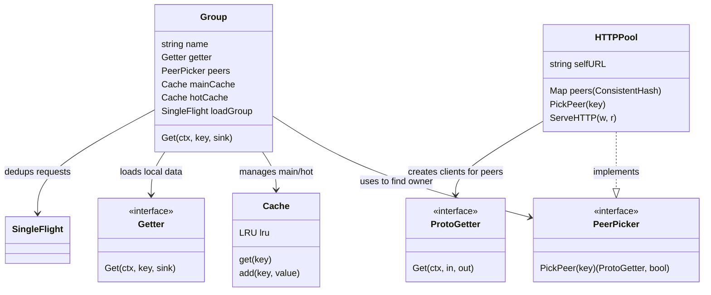
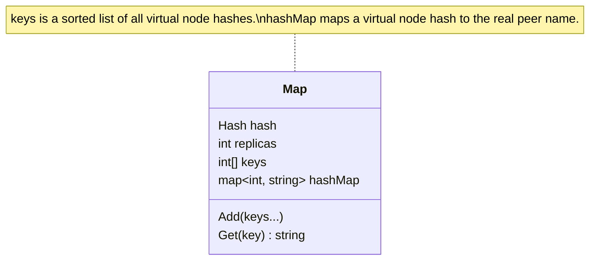
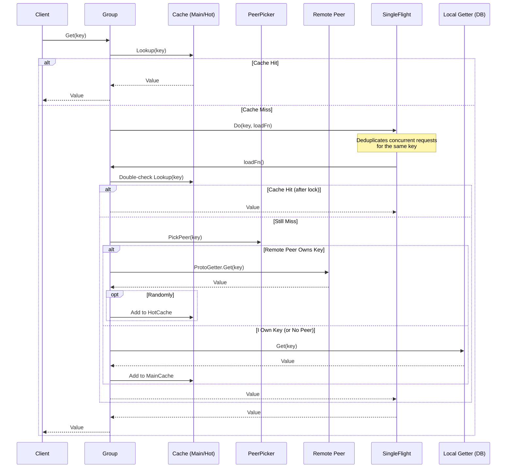

# Groupcache Design and Implementation Study

## 1. System Overview

`groupcache` is a distributed caching and cache-filling library for Go. It is designed to be a replacement for memcached in many scenarios, but with key differences:
- It is a **library**, not a separate server. It runs within your application process.
- It coordinates **cache filling**. This prevents the "thundering herd" problem where many clients rush to the database simultaneously on a cache miss. Only one process loads the data, and the result is multiplexed to all callers.
- It uses **consistent hashing** to distribute keys across peers.
- It does not support cache expiration or explicit eviction (LRU only). It assumes immutable values.

## 2. High-Level Architecture

The system consists of multiple peer processes (nodes) that form a distributed cache. Each node runs the same code and knows about the other peers.

```mermaid
graph TD
    Client[Client Application] -->|Get Key| Node1[Node 1 (Local)]

    subgraph Cluster [Groupcache Cluster]
        Node1
        Node2[Node 2]
        Node3[Node 3]
        Node4[Node 4]
    end

    Node1 -->|Pick Peer| CH{Consistent Hash}
    CH -->|Hash(Key) -> Node 2| Node2
    CH -->|Hash(Key) -> Node 1| DB[(Database/Source)]

    Node2 -->|Get| DB
    Node1 -.->|HTTP/Proto| Node2
```

## 3. Component Interaction

The core components work together to ensure efficient data retrieval and storage.

*   **Group**: The main entry point. Represents a cache namespace (e.g., "thumbnails", "profiles").
*   **HTTPPool**: Implements the `PeerPicker` interface. Manages the list of peers and handles HTTP transport.
*   **ConsistentHash**: Maps keys to specific peers.
*   **SingleFlight**: Ensures only one request for a specific key is in flight at a time.
*   **LRU Cache**: Manages memory usage by evicting least recently used items.
*   **Sinks**: Interfaces for receiving data (allocating bytes, using existing buffers, etc.).



## 4. Core Data Structures

Understanding the internal data structures of key components reveals how `groupcache` achieves efficiency and thread safety.

### Consistent Hash Map (`consistenthash/consistenthash.go`)

This component maps input keys to one of the available peer nodes.



*   **`keys []int`**: A sorted slice of hash values. Each peer is hashed `replicas` times (default 50) with different suffixes (e.g., "0node1", "1node1") to create "virtual nodes". This ensures even distribution.
*   **`hashMap map[int]string`**: Maps the hash of a virtual node back to the actual peer name (e.g., `12345` -> "10.0.0.1:8080").
*   **Lookup**: To find the peer for a given key, the key is hashed, and a **binary search** (`sort.Search`) is performed on `keys` to find the first virtual node hash `>=` the key's hash.

### LRU Cache (`lru/lru.go`)

A classic Least Recently Used cache implementation.

```mermaid
classDiagram
    class Cache {
        int MaxEntries
        func OnEvicted
        List ll
        map~interface{}, *Element~ cache
        Add(key, value)
        Get(key)
        RemoveOldest()
    }

    class List {
        <<Doubly Linked List>>
        Front() *Element
        Back() *Element
        PushFront(value)
        MoveToFront(e)
    }

    class Element {
        Value interface{}
        Next()
        Prev()
    }

    Cache *-- List : stores order
    Cache *-- Element : map values point to list elements
```

*   **`ll *list.List`**: A doubly linked list. The most recently used item is at the front; the least recently used is at the back.
*   **`cache map[interface{}]*list.Element`**: A map providing O(1) access to list elements by key.
*   **Eviction**: When `MaxEntries` is reached, `RemoveOldest()` removes the element at the back of the list and deletes it from the map.

### Singleflight Group (`singleflight/singleflight.go`)

Ensures that only one execution of a function (e.g., a database load) happens at a time for a given key.

```mermaid
classDiagram
    class Group {
        Mutex mu
        map~string, *call~ m
        Do(key, fn) (interface{}, error)
    }

    class call {
        WaitGroup wg
        interface{} val
        error err
    }

    Group "1" *-- "many" call : tracks in-flight requests
```

*   **`m map[string]*call`**: Tracks currently executing calls. If a key exists in this map, it means a request is already in progress.
*   **`call`**: Represents a single execution.
    *   **`wg sync.WaitGroup`**: Other callers `Wait()` on this if the call is already in progress.
    *   **`val`, `err`**: Store the result once the function completes.
*   **Flow**:
    1.  Lock `mu`.
    2.  Check if `key` is in `m`.
    3.  If yes (duplicate), unlock `mu` and `Wait()` on the existing `call.wg`. Return its result.
    4.  If no, create a new `call`, add to `m`, unlock `mu`.
    5.  Execute `fn()`.
    6.  Store result in `call`, call `wg.Done()`.
    7.  Lock `mu`, delete `key` from `m`, unlock.

## 5. Data Flow: The `Get` Lifecycle

When a client requests a key via `Group.Get(key)`, the following sequence occurs:



## 6. Key Concepts

### Consistent Hashing (`consistenthash/`)
Maps keys to nodes (peers).
- Uses a hash ring (CRC32 by default).
- Supports **Virtual Nodes** (replicas) to ensure even distribution of keys even with a small number of physical nodes.
- When a node is added/removed, only `1/N` keys need to be remapped.

### Singleflight (`singleflight/`)
Prevents "Thundering Herd".
- If 1000 requests for "key_A" arrive simultaneously and "key_A" is missing from the cache:
    - The first request starts the load process (local DB or remote peer).
    - The other 999 requests block, waiting for the first one to finish.
    - Once the first returns, the result is shared with all 1000 callers.
- This dramatically reduces load on the backing store.

### Main vs. Hot Cache
`Group` maintains two LRU caches:
1.  **MainCache**: Stores keys that **this node owns** (according to consistent hashing). These are populated when the node loads data locally via its `Getter`.
2.  **HotCache**: Stores keys that **other nodes own** but are popular.
    - When fetching from a remote peer, there is a random chance (10%) the item will be added to the HotCache.
    - This prevents network hotspots. If a key is extremely popular, many nodes will cache it locally in their HotCache, avoiding the network trip to the owner.

### Protocol Buffers
- Communication between peers uses Protocol Buffers (`groupcachepb/`) for efficiency.
- `GetRequest` contains the group name and key.
- `GetResponse` contains the value.
