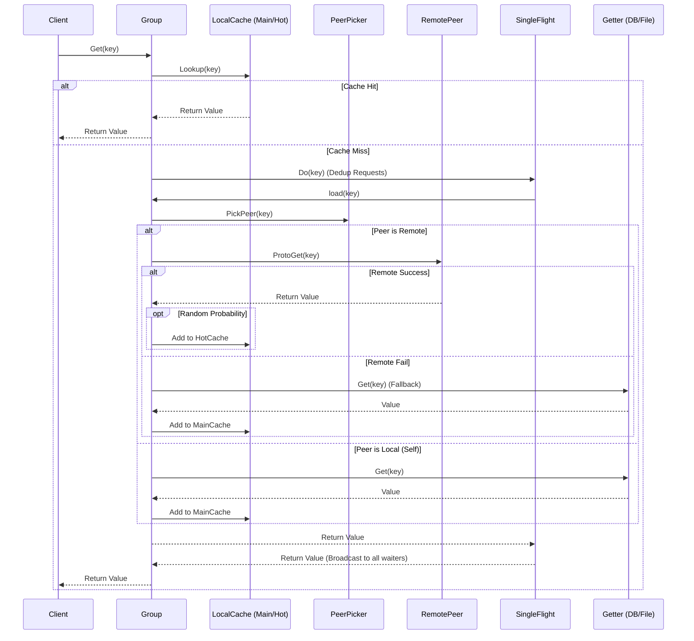
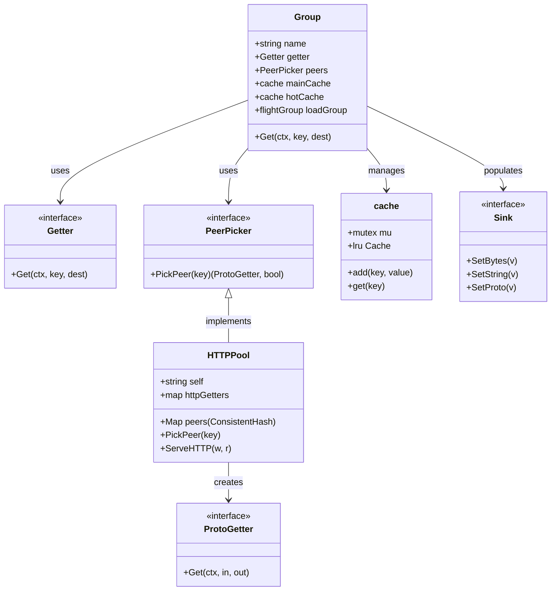

# Groupcache 源码分析与学习笔记

## 1. 简介 (Introduction)

`groupcache` 是一个分布式缓存和缓存填充库，最初由 Google 的 dl.google.com 团队开发。它的设计目标是在许多情况下替代 memcached 集群。

与 memcached 不同，`groupcache` 是一个客户端库，嵌入在应用进程中，不需要单独的缓存服务器。由于是嵌入式的，它大幅减少了部署和配置的痛苦。节点之间通过一致性哈希（Consistent Hashing）相互通信，形成一个分布式缓存集群。

**主要特性：**
*   **分布式**：通过一致性哈希将键（Key）分片到不同的对等节点（Peer）。
*   **无服务器**：作为库直接集成在应用中。
*   **缓存填充（Cache Filling）**：这是 `groupcache` 最核心的特性。当缓存未命中时，它会协调只有一个进程去加载数据（Singleflight），然后将结果复用给所有并发请求，从而避免了“惊群效应”（Thundering Herd）。
*   **不可变性**：一旦某个键的值被设置，它就是不可变的。不支持更新、过期时间或显式删除（只通过 LRU 淘汰）。
*   **热点镜像（Hot Spot Mirroring）**：支持自动将超热点数据复制到非 Owner 节点，以分担 Owner 的负载。

---

## 2. 核心概念 (Core Concepts)

### Group
`Group` 是 `groupcache` 的核心对象，代表一个缓存命名空间。每个 `Group` 都有一个唯一的名称（如 "users", "thumbnails"），并包含：
*   **Getter**: 用户提供的回调函数，用于在缓存未命中且必须由本地加载时获取数据（例如从数据库读取）。
*   **MainCache**: 本地拥有的缓存（该节点是这些 Key 的 Owner）。
*   **HotCache**: 热点缓存（该节点不是 Owner，但因为该 Key 访问频繁，所以复制一份在本地）。
*   **Peers**: 节点列表，用于通过一致性哈希选择 Key 的 Owner。

### Getter
`Getter` 是一个接口，只有一个方法 `Get(ctx, key, dest)`。当缓存未命中时，`groupcache` 会调用它来加载数据。

### Peers (PeerPicker)
`PeerPicker` 负责根据 Key 选择对应的 Peer。默认实现是 `HTTPPool`，它使用一致性哈希算法。

### Cache (Main & Hot)
`groupcache` 使用 LRU（最近最少使用）算法来管理内存。
*   **MainCache**: 存储本节点负责的 Key。
*   **HotCache**: 存储其他节点负责，但被本节点频繁访问的 Key。

---

## 3. 系统工作流 (System Workflow)

当调用 `group.Get(ctx, key, dest)` 时，流程如下：



### 详细步骤：
1.  **本地缓存查找**：首先检查 `MainCache` 和 `HotCache`。如果命中，直接返回。
2.  **Singleflight**：如果未命中，进入 `load` 过程。使用 `singleflight` 确保对于同一个 Key，同一时刻只有一个请求去执行加载操作。
3.  **选择 Peer**：使用 `PeerPicker` 根据 Key 计算哈希，找到该 Key 的 Owner 节点。
4.  **远程获取 (Remote Fetch)**：
    *   如果 Owner 是远程节点，发送 RPC (默认 HTTP) 请求获取数据。
    *   如果远程获取成功，有一定概率（默认 10%）将数据写入本地 `HotCache`，以应对热点。
5.  **本地获取 (Local Fetch)**：
    *   如果 Owner 是自己，或者远程获取失败，则调用用户提供的 `Getter` 加载数据。
    *   加载成功后，将数据写入本地 `MainCache`。

---

## 4. 核心组件架构 (Component Architecture)



---

## 5. 关键组件深挖 (Key Components Deep Dive)

### 5.1 Consistent Hashing (`consistenthash/consistenthash.go`)
为了在节点增删时最小化数据迁移，`groupcache` 使用一致性哈希。
*   **虚拟节点 (Replicas)**：为了解决数据倾斜问题，每个物理节点对应多个虚拟节点（默认为 50 个）。
*   **哈希环**：所有的虚拟节点哈希值排序后形成一个环。Key 的哈希值顺时针找到的第一个虚拟节点即为 Owner。
*   **实现**：使用 `crc32.ChecksumIEEE` 作为默认哈希函数。使用 `sort.Search` 进行二分查找定位节点。

### 5.2 Singleflight (`singleflight/singleflight.go`)
这是防止缓存击穿（Cache Stampede）的神器。
*   **原理**：用一个 map 记录正在处理的 Key。
*   **合并**：当第一个请求来时，创建一个 `call` 对象并加锁。后续相同的 Key 请求发现 map 中已有记录，就 `wait` 在那个 `call` 上，不再发起新的加载请求。
*   **广播**：当第一个请求完成，结果被填充到 `call` 中，所有等待的请求同时返回相同的结果。

### 5.3 LRU Cache (`lru/lru.go`)
*   **双向链表 + Map**：标准 LRU 实现。Map 存 Key -> Element 指针，链表存 Element（即 Key-Value）。
*   **淘汰策略**：当内存超出限制时，从链表尾部移除最久未使用的节点，并从 Map 中删除。
*   **OnEvicted**：支持淘汰回调，用于统计或清理资源。

### 5.4 ByteView (`byteview.go`)
*   **不可变视图**：`ByteView` 包装了 `[]byte` 或 `string`。一旦创建，内容不可变。
*   **零拷贝**：在传递数据时，尽量避免深拷贝，直接传递 `ByteView` 结构体（值传递，但内部引用了底层数据）。

---

## 6. 深入剖析与架构权衡 (Deep Dive & Trade-offs)

### 6.1 内存管理与零拷贝 (Memory Management & Zero-Copy)
`groupcache` 非常注重运行时的性能和 GC（垃圾回收）压力，这主要体现在 `ByteView` 和 `Sink` 接口的设计上。
*   **ByteView 的不可变性**：`ByteView` 结构体同时包含 `[]byte` 和 `string` 两个字段。由于 Go 中 `string` 与 `[]byte` 的互相转换会导致内存分配和拷贝，`ByteView` 在初始化时保存原始类型，并在读取时优先返回对应类型，避免了隐式拷贝。此外，作为值类型（Value Type）传递，而不是指针传递，它使得开发者无需引入读写锁（RWMutex）就可以安全地在多线程环境下共享数据。
*   **Sink 接口抽象**：`Get` 方法并没有简单地返回 `[]byte`，而是要求传入一个 `Sink`。这类似于**访问者模式 (Visitor Pattern)**。如果你最终需要的是一个 Protobuf 对象，你可以传入 `ProtoSink`。`groupcache` 内部拿到字节流后，会直接将其 Unmarshal 到你的对象中，而不需要先返回一个 `[]byte` 切片，然后再由应用层进行反序列化，这样可以大幅减少堆内存的分配（Allocations）。

### 6.2 热点缓存机制 (HotCache Population)
一致性哈希的一个致命弱点是：如果某个 Key 极其热门（例如大促活动时的首页配置），那么这一个 Owner 节点会承受所有的流量，导致网卡或 CPU 被打满（即“热点问题”/ Hotspotting）。
*   `groupcache` 引入了 `hotCache`。如果本节点不是该 Key 的 Owner，它去远端请求并成功拿到数据后，会有一个**随机概率（默认是 10%，见 `groupcache.go:getFromPeer` 中的 `rand.Intn(10) == 0`）**将该数据也放入自己的本地 `hotCache` 中。
*   **数学逻辑**：为什么是概率？如果每次都存入，会导致所有节点都拥有一份全量拷贝，浪费大量内存；如果概率太低，起不到分担压力的作用。10% 的概率意味着，如果这个 Key 被请求了 1000 次，大约会有 100 次将数据留在各个客户端本地，后续这些客户端的请求就不会再打到 Owner 节点，从而完美地平滑了瞬时高并发流量。

### 6.3 Protobuf 优化集成
在 `http.go` 中，节点之间的 RPC 请求和响应也是使用了 Protobuf（见 `groupcachepb` 包）。除了序列化体积小、速度快之外，结合上面提到的 `Sink` 接口，如果应用层请求的也是 Protobuf 数据，`groupcache` 甚至可以直接对底层字节流做一次反序列化就直达业务逻辑。

### 6.4 与外部缓存系统 (Redis/Memcached) 的对比权衡

1.  **Immutability (不可变性)**
    *   **决策**：不支持 Key 的更新和删除。
    *   **原因**：简化了一致性模型。如果允许更新，就需要处理缓存失效、版本控制、分布式一致性等复杂问题。
    *   **权衡**：不适合数据频繁变化的场景。如果数据变化，通常建议使用新的 Key（例如带版本号 `user:123:v2`）。

2.  **No Expiration (无过期时间)**
    *   **决策**：没有 TTL（Time To Live）。
    *   **原因**：简化设计，完全依赖 LRU 算法进行内存管理。
    *   **权衡**：如果内存充足，旧数据可能一直存在。必须通过内存上限来强制淘汰。

3.  **Peer-to-Peer (去中心化)**
    *   **决策**：客户端即服务器。
    *   **原因**：消除了对中心化缓存集群（如 Memcached 甚至 Redis）的依赖，减少了网络跳数（对于 Owner 为本地的情况）。
    *   **权衡**：应用部署更加复杂（需要感知其他节点 IP），且应用重启会导致缓存丢失（因为缓存就在应用内存中）。

4.  **Thundering Herd Protection (防惊群)**
    *   **决策**：强制使用 Singleflight。
    *   **本质**：这是 Groupcache 最核心的价值之一。它牺牲了一点点并发处理的灵活性（必须等待 Owner 加载），换取了后端存储（DB）的绝对安全。

---

## 7. 实战演练 (Hands-on Demo)

为了让你更好地理解 `groupcache` 的工作流程，我创建了一个可运行的示例程序。

### 运行步骤：

1.  进入 `example` 目录：
    ```bash
    cd example
    ```
2.  运行测试脚本（或者手动启动三个终端运行 main.go）：
    ```bash
    ./run.sh
    ```

### 示例说明 (`example/main.go`)：
*   **模拟数据库**：使用一个 `map` 模拟慢速数据库（包含 "Tom", "Jack", "Sam"）。
*   **集群模拟**：启动了 3 个 HTTP 节点（8001, 8002, 8003）。
*   **客户端**：通过 `/api?key=xxx` 接口发起请求。
*   **观察日志**：你可以看到请求是如何被转发到 Owner 节点，以及数据是从 DB 加载还是从缓存读取的。

---

这篇文档旨在帮助你快速建立 `groupcache` 的全局视野。接下来，你可以通过阅读代码注释和运行示例来加深理解。
