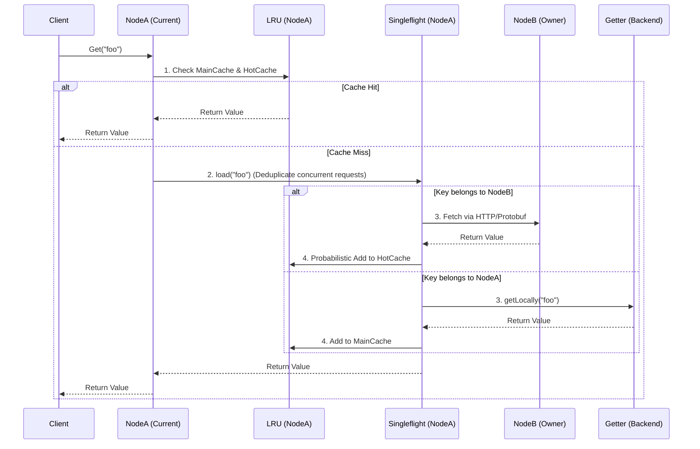
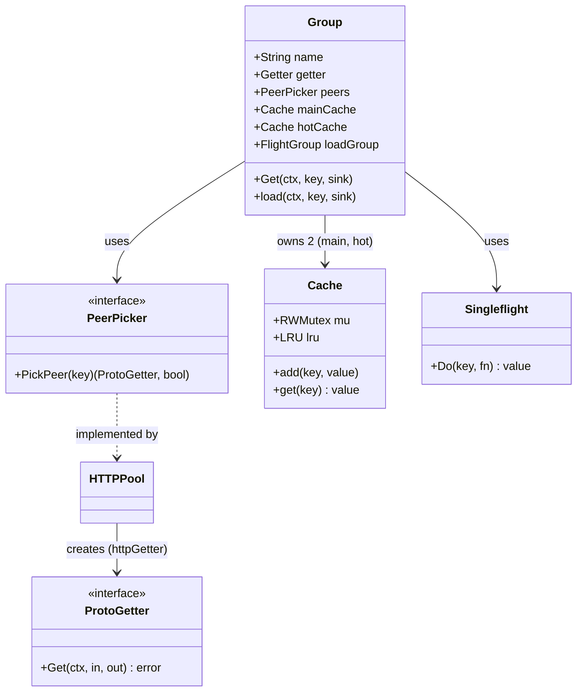

# `groupcache` Rust 重构技术方案

## 1. 当前架构设计与实现梳理

`groupcache` 是一个分布式缓存和缓存填充库。与 memcached 等独立部署的缓存服务器不同，它是一个包含服务器和客户端双重身份的库。应用自身即是缓存节点，通过点对点（P2P）的方式组成集群。

### 核心设计哲学
- **无状态时间线（No Expiration）**：仅使用 LRU 策略控制内存占用，不支持基于时间（TTL）的过期。
- **防止缓存击穿（Singleflight）**：利用请求合并，确保即使面对瞬时巨量并发访问同一未缓存的 key，也仅有一条请求落到后端数据源（本地 getter 或是远端 peer）。
- **去中心化（Peer-to-Peer）**：基于一致性哈希（Consistent Hashing），对 key 进行路由，节点相互通信（默认使用 HTTP 通信和 Protobuf 序列化）。
- **热点数据镜像（HotCache & MainCache）**：不仅缓存自身负责的 Key（MainCache），对于请求远端 peer 获得的数据，会以一定概率（10%）缓存到本地的热点缓存（HotCache）中，以此应对单点网络热点。
- **不可变零拷贝（ByteView & Sink）**：使用 `ByteView` 作为不可变字节切片视图，保证并发安全；使用 `Sink` 接口抽象数据载体（如分配新 slice、复用 buffer 或是反序列化 Protobuf）。

### 系统架构工作流

### 核心组件交互模型

---

## 2. Rust 重构技术方案

为了保持 `groupcache` 优秀的架构理念并发挥 Rust 的语言优势，我们将主要采用**基于 `tokio` 的异步模型**，并利用 `prost` 实现与原版 Go 代码 100% 协议兼容的 Protobuf 序列化。

### 2.1 技术栈选型
- **异步运行时**: `tokio` (业界标准，适合高并发 I/O)。
- **HTTP 客户端与服务端**:
  - 路由与 Server: `axum` (轻量、与 tokio 完美融合，适合构建 `/_groupcache/` 端点)。
  - Client: `reqwest` (基于 hyper，性能优异)。
- **Protobuf**: `prost` 和 `prost-build` (轻量且高性能，直接生成纯粹的 Rust struct)。
- **并发控制**:
  - `tokio::sync::Mutex` 和 `tokio::sync::RwLock`。
  - `dashmap` (用于 singleflight 等场景的细粒度锁映射，或使用基于 `std::sync::Mutex` 的定制版本以避免异步死锁)。
- **不可变数据与内存管理**: `bytes::Bytes`。这完美契合了 Go 版本中的 `ByteView` 设计，允许我们在不拷贝底层数据的情况下共享数据流。

### 2.2 Rust-native 设计哲学探讨与映射

**1. ByteView (Go) -> `bytes::Bytes` (Rust)**
Go 中的 `ByteView` 用于包装 `[]byte` 或 `string`，实现无拷贝引用。在 Rust 中，`bytes::Bytes` 是此场景的完美替代。它是一个基于引用计数的连续字节片段结构，可以在多线程异步任务间极低成本地克隆（只增加引用计数），避免了高昂的深度内存拷贝操作。

**2. Sink 接口 -> Rust Enum/Trait**
Go 中 `Sink` 使用反射或类型断言处理目标类型。在 Rust 中，由于强类型的要求，我们可将 `Sink` 映射为一个泛型 Trait，或者利用 Rust 的 Enum 机制枚举不同的数据承载策略（如 `BytesSink`, `StringSink`, `ProtoSink`）。这避免了运行时开销并增加了类型安全性。

**3. Singleflight -> 异步请求折叠**
在 Go 中，`singleflight` 阻塞 Goroutine。在 Rust 中，我们需要实现一个异步安全的 `Singleflight`。可以利用一个共享的 `HashMap<String, tokio::sync::broadcast::Sender>`：
- 当首个请求到达时，插入 Sender 并启动实际抓取异步任务。
- 后续并发请求发现 key 已存在，通过 `Sender.subscribe()` 挂起，等待抓取完成被广播唤醒。
这样既防止了缓存击穿，又充分利用了 Rust 的异步原语而不会阻塞系统线程。

**4. LRU 缓存与锁**
Go 中使用 `sync.RWMutex` 保护单个 LRU。在 Rust 异步环境里，直接使用标准的 `std::sync::Mutex` 对 LRU 进行保护可能足以应对（因为 LRU 操作仅为内存 O(1) 操作，极快，若非必要不需引入 `tokio::sync::Mutex` 导致协程切换开销）。我们会建立一个 `Cache` 结构，内部封装 LRU，提供线程安全访问。

### 2.3 保证网络协议（Wire Compatibility）100% 兼容
为了让 Rust 版本的 `groupcache` 能与现有 Go 版本在同一集群中工作：
1. **Protobuf 一致性**：严格使用原项目的 `groupcachepb/groupcache.proto`，利用 `prost-build` 生成 Rust 代码。
2. **HTTP Path**：确保监听和请求 URL 严格匹配 Go 的规则：`{BasePath}{Group}/{Key}`，其中 Group 和 Key 必须经过 URI 编码。
3. **HTTP Header**：响应需要包含 `Content-Type: application/x-protobuf`。
4. **一致性哈希**：一致性哈希算法必须完全对齐。Go 使用的默认哈希函数是 `crc32.ChecksumIEEE`，映射 key 时的逻辑是将分片编号转为字符串并与节点名称拼接（如 `0http://10.0.0.2:8000`）。在 Rust 中我们将使用 `crc32fast` 库，并严格复制其 `strconv.Itoa(i) + key` 的拼接规则。

---

## 3. 分步骤的执行流程

在计划被您确认并且我们正式开始之后，我们将按以下步骤分步执行：

### Step 1: 项目初始化与基础结构建立
- 创建 Rust Cargo 项目结构（Library + 示例/测试 bin）。
- 在 `build.rs` 中集成 `prost-build`，根据 `groupcache.proto` 编译 Protobuf 数据模型。
- 定义核心的 `Bytes` 相关的类型以取代 Go 的 `ByteView`。

### Step 2: 核心底层组件移植
- 实现一致性哈希 `consistenthash`：结合 `crc32fast` 复制 Go 版本的分配逻辑，并编写严格的比对测试。
- 实现 `LRU` 缓存机制及其线程安全包装 `Cache`，保证内存按容量回收以及计算占用量时的准确性。
- 实现异步 `singleflight` 模块，并编写多任务并发访问测试确保数据仅被获取一次。

### Step 3: 分布式传输与协议层 (`HTTPPool` / `PeerPicker`)
- 基于 `reqwest` 实现 `ProtoGetter` 客户端，以发起对远端节点的 Protobuf 请求。
- 基于 `axum` 实现 HTTP Server，挂载监听 `/_groupcache/` 路由，处理对等节点的请求并将结果作为 protobuf 返回。
- 集成 `PeerPicker`，将一致性哈希与可用的 HTTP 对等节点进行绑定。

### Step 4: 核心逻辑整合 (`Group` 结构)
- 实现最核心的 `Group` 逻辑。
- 组合 `LRU` (Main/Hot cache), `singleflight`, `PeerPicker` 和本地 `Getter`。
- 实现 `Get` 的全链路逻辑（命中 -> singleflight -> 路由(本地 vs 远端) -> 热点缓存处理(概率10%)）。
- 实现并暴露出统计接口 (`Stats`) 追踪系统的击中率、加载等信息（可使用 `std::sync::atomic` 的原子类型记录）。

### Step 5: 测试验证与迭代
- 编写集成测试，在一个进程内启动多个绑定本地不同端口的 `axum` 实例模拟多节点集群。
- 模拟并发读取与单点故障行为，验证 `singleflight` 和一致性哈希重定向的正确性。
- 进行文档编写和样例完善。
